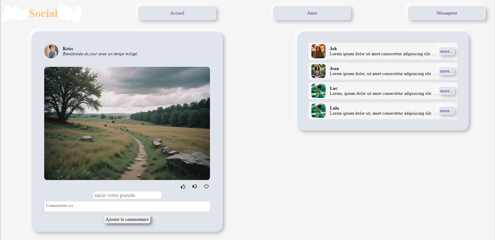

Création d'un mini-réseau social pour un processus d'embauche.

L'employeur précise les technologies à utiliser :
HTML, CSS et JavaScript.
Ne pas utiliser de Framework ni d'Api.

- fonction de "drag and drop"
- 

Style : L'interface doit adopter un style "neumorphisme".
À noter : L'UI/UX n'est pas prioritaire,

